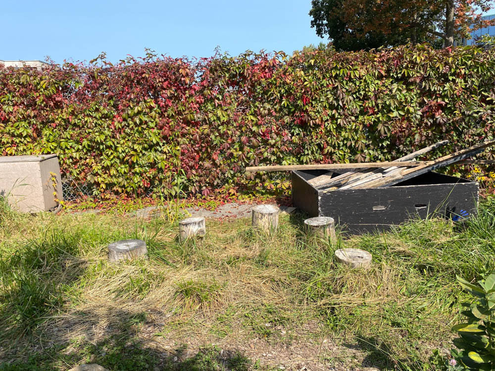
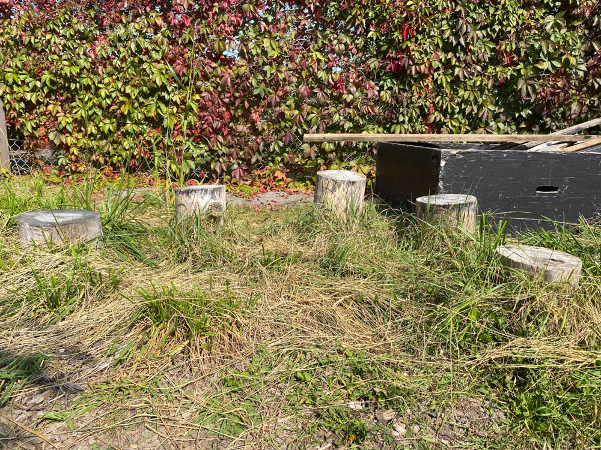
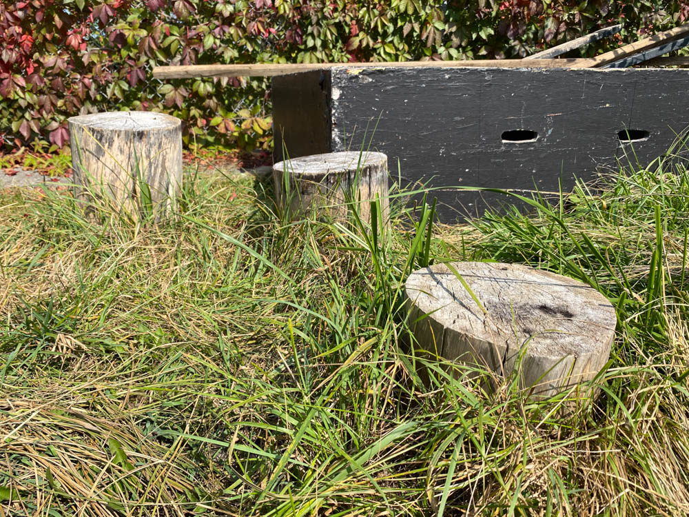
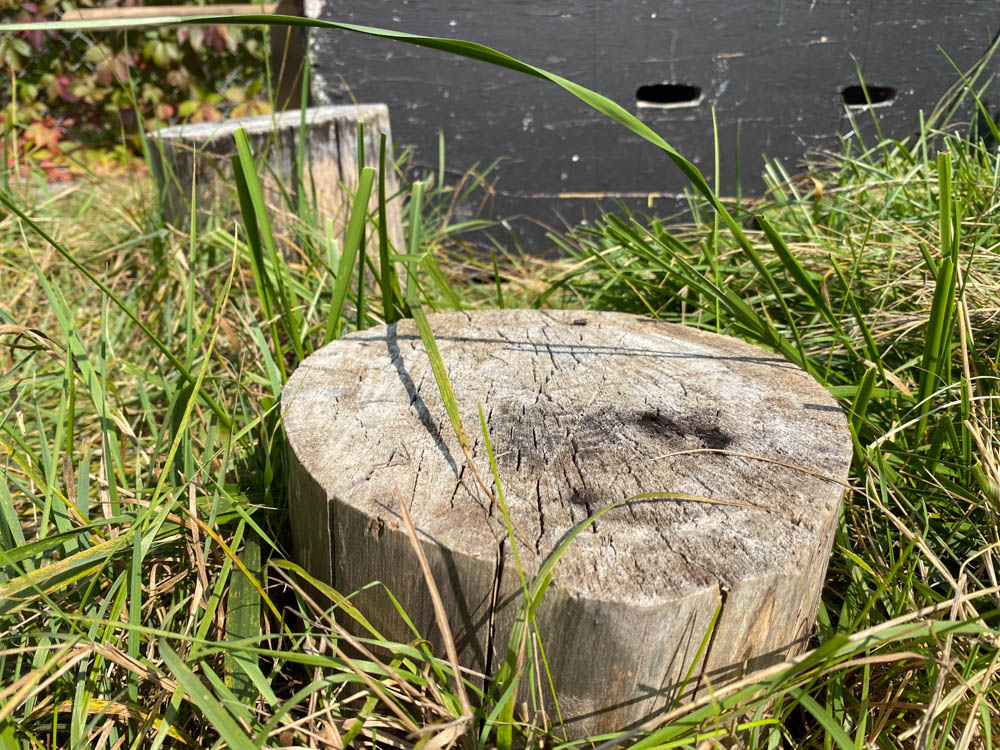
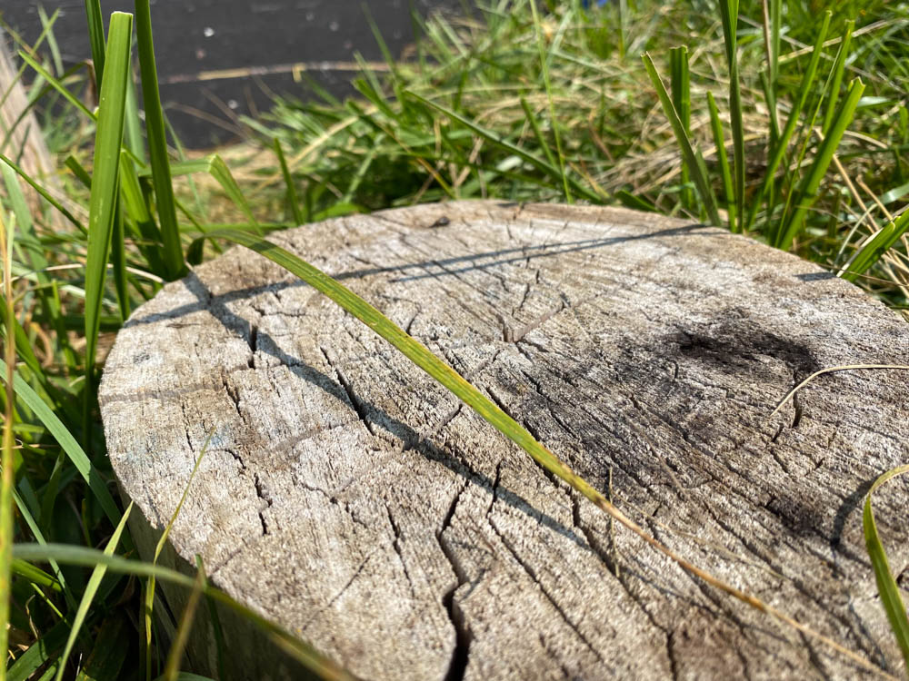

# 582-104-va-photo-cinema

<!-- ## Editing

[All.I.Can (FULL DOCUMENTARY) Skiing, Big Mountain skiing, Chile, Morocco, Alaska, BC](https://www.youtube.com/watch?v=3x4GtMiMyk8&ab_channel=EchoboomSports) - [59:30](https://youtu.be/3x4GtMiMyk8?t=3570)

[JP Auclair Street Segment (from Sherpas Cinemas' All.I.Can)](https://www.youtube.com/watch?v=1-VCWUtNm-4&ab_channel=SherpasCinema) -->

## Lighting Patterns

[Portrait Fundamentals: Lighting Patterns](https://www.digitalphotomentor.com/lessons/portrait-lighting-lighting-patterns/)

## Cinematography

[Visions of Light](https://vimeo.com/497115013)

## Reverse Film School | Vanity Fair

[What Happens When A Movie Has No Script Supervisor?](https://www.youtube.com/watch?v=NAvn7CNpdB8&ab_channel=VanityFair)

[What Happens When A Movie Has No Gaffer?](https://www.youtube.com/watch?v=wXcc79AmkyU&ab_channel=VanityFair)

[What Happens to a Movie Without a Camera Operator?](https://www.youtube.com/watch?v=Kq_qBUeSLl4&ab_channel=VanityFair)

## Continuity - 180 Degree Rule

[Film School: Establishing Film Continuity](https://www.youtube.com/watch?v=ALguEHV9VvA&ab_channel=NewYorkFilmAcademy)

## Subjective / Objective Perspective & POV Shots

[CAMERA ANGLES: OBJECTIVE, SUBJECTIVE OR POINT OF VIEW?](https://storystruggles.blogspot.com/2018/03/camera-angles-objective-subjective-or.html)

[What Is Character Perspective?](https://vimeo.com/219223876)

[Cinematographer Explains 3 Different Camera Lenses | Vanity Fair](https://www.youtube.com/watch?v=DGujsKb2e10&ab_channel=VanityFair)

[Cinematic blend between subjective and objective POV](https://www.youtube.com/watch?v=u-Rdh1K-jEE&ab_channel=JanStripek)

[THE LAB: DECOY | 6 Photographers 1 Man - A Portrait Photography Session With A Twist](https://www.youtube.com/watch?v=F-TyPfYMDK8&ab_channel=CanonAustralia)

[Flamingo Chicks Trapped in Frozen Lake | Eden: Untamed Planet | BBC Earth](https://www.youtube.com/watch?v=-DerMxKmFdc&ab_channel=BBCEarth)

[Wild Hamster Has A Graveyard Feast | Seven Worlds, One Planet | BBC Earth](https://www.youtube.com/watch?v=rkZ6gzyg7yY&ab_channel=BBCEarth)

## Storyboards

[Camera Angles Cheatsheet](https://downloads.boords.com/boords-camera-angles.pdf)

[The Purpose Of Storyboarding](https://www.youtube.com/watch?v=BSOJiSUI0z8&ab_channel=picassosson)

[Storyboard to Screen - Parasite: The Montage Scene](https://www.youtube.com/watch?v=y_j3ZyKXoXU&ab_channel=CinemaUniversity)
​

[Watch Disney Animation’s Head Of Story Share Animation Secrets & Sketch](https://www.youtube.com/watch?v=IomgUWKjUxA&ab_channel=SYFY)

Bonus:

[Lessons From The Parasite Storyboards](https://www.youtube.com/watch?v=JE26E4IM_-g&ab_channel=ThomasFlight)

## Shot Size

[Shot (filmmaking)](https://en.wikipedia.org/wiki/Shot_(filmmaking))

[Shot Size in Filmaking](https://www.learnaboutfilm.com/film-language/picture/shotsize/) - 
[PDF](https://www.learnaboutfilm.com/pdf/lafshotsize.pdf)

[Dark Knight - Opening Scene](https://www.youtube.com/watch?v=0OYBEquZ_j0&ab_channel=coolhands7)

[PBS PREVIEWS: NATIONAL PARKS](https://www.youtube.com/watch?v=mx8WbZIWCSM&ab_channel=PBS)

[DamNation | Patagonia Films](https://www.youtube.com/watch?v=laTIbNVDQN8&ab_channel=Patagonia)

### Exercise demo / example

<!-- [Artifishal | Patagonia Films](https://www.youtube.com/watch?v=XdNJ0JAwT7I&ab_channel=Patagonia-->

<!-- [The Good The Bad and the Ugly - Ending Scene](https://youtu.be/6RvVRgNr08Y?t=11) -->

<!-- [Lesson 6: Visuals that move](https://www.itma.vt.edu/courses/visual/lesson_6_2.php)

[A Guide Toward Camera Shots, Frames and Sizes](https://postpace.io/blog/a-guide-toward-camera-shots-frames-and-sizes/)

[Photo Composition Part 1: Rule of Thirds and Shot Size](https://technicallyfunctional.org/2022/03/14/photo-composition-part-1-rule-of-thirds-and-shot-size/) 

[Guide to Camera Shots: Every Shot Size Explained](https://www.studiobinder.com/blog/types-of-camera-shots-sizes-in-film/)-->

## Composition

[Elements of Art](https://www.getty.edu/education/teachers/building_lessons/formal_analysis.html)
<!-- https://courses.edtechleaders.org/crystalbridges/taa/cb_s1.html -->
<!-- [Introducing Formal Analysis: Still Life](https://www.youtube.com/watch?v=kxALpig_Cac&ab_channel=GettyMuseum) -->

<!-- [Types of camera angles](http://storystruggles.blogspot.com/2018/03/camera-angles-objective-subjective-or.html) -->

<!-- [What is Character Perspective?](https://vimeo.com/219223876) -->

## Camera Basics

[Cameras and Lenses](https://ciechanow.ski/cameras-and-lenses/)

### Essential Videos

[Make your own pinhole camera to watch solar eclipse](https://www.youtube.com/watch?v=-mY5xwR_kl0&ab_channel=WSLS10)

[Abelardo Morell and the magic of the camera obscura](https://www.youtube.com/watch?v=X-CRKOtlceg&ab_channel=SanFranciscoMuseumofModernArt)

[We Turned this Truck into a GIANT CAMERA!](https://www.youtube.com/watch?v=qIp9kItDUh8&ab_channel=PhysicsGirl)

[High Speed video of Canon DSLR Shutter - Smarter Every Day 40](https://www.youtube.com/watch?v=Q07CTj4fUeY&ab_channel=SmarterEveryDay)

[Why Do Cameras Do This? | Rolling Shutter Explained - Smarter Every Day 172](https://www.youtube.com/watch?v=dNVtMmLlnoE&ab_channel=SmarterEveryDay)

### Bonus Videos

[How the Germans Measured Milliseconds MECHANICALLY - Smarter Every Day 283](https://www.youtube.com/watch?v=Q07CTj4fUeY&ab_channel=SmarterEveryDay)

#### More Camera Obscura / Pinhole Cameras

[Abelardo Morell: The Universe Next Door](https://www.youtube.com/watch?v=JGskRHwr3g4&ab_channel=GettyMuseum)

[International Orange: Abelardo Morell, Tent Camera Photographs](https://www.youtube.com/watch?v=EV-qwEUCWtw&ab_channel=FOR-SITEFoundation)

#### Film is back(!)

[How Does Film ACTUALLY Work? (It's MAGIC) [Photos and Development] - Smarter Every Day 258](https://www.youtube.com/watch?v=TCxoZlFqzwA&ab_channel=SmarterEveryDay)

[How Does Kodak Make Film? (Kodak Factory Tour Part 1 of 3) - Smarter Every Day 271](https://www.youtube.com/watch?v=HQKy1KJpSVc&ab_channel=SmarterEveryDay)

[How Does Kodak Make Film? (Kodak Factory Tour Part 2 of 3) - Smarter Every Day 275](https://www.youtube.com/watch?v=cAAJUHwh9F4&ab_channel=SmarterEveryDay)

[This Thing is Crazy Fast - Smarter Every Day 286](https://www.youtube.com/watch?v=mrJP82ZZiag&ab_channel=SmarterEveryDay)

[How Kodak Exposed Nuclear Testing](https://www.youtube.com/watch?v=7pSqk-XV2QM&ab_channel=Veritasium)